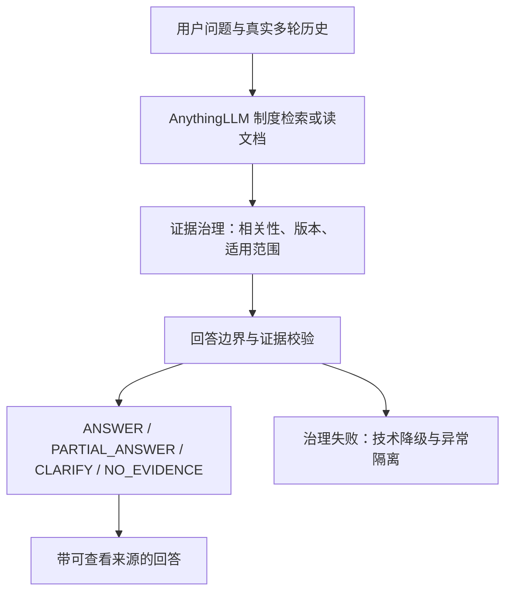
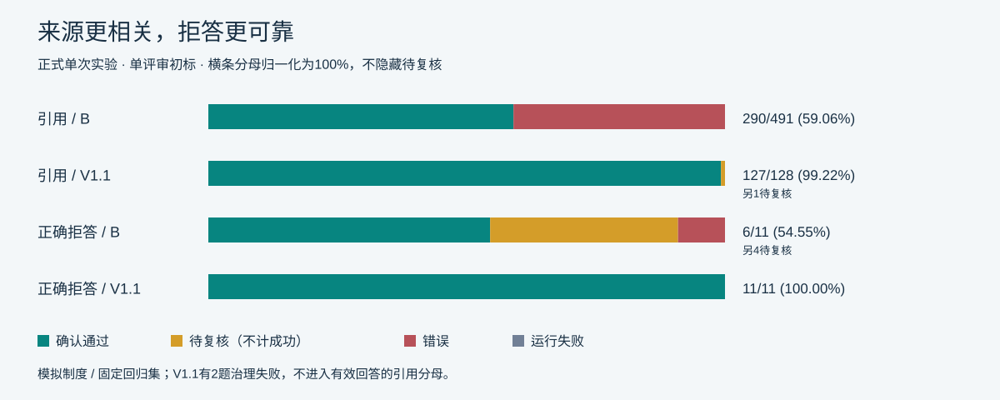
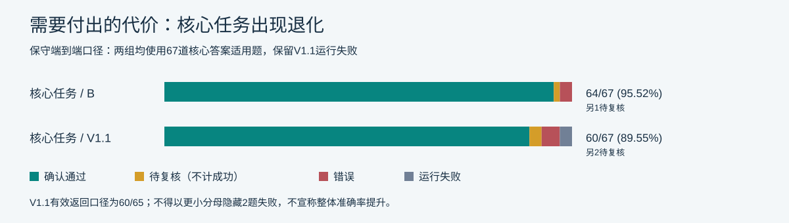
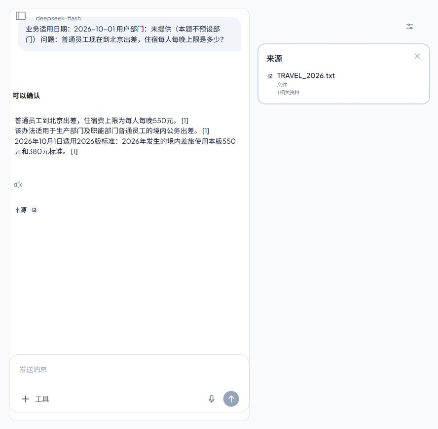

# 企业制度问答 Agent
### Trusted Enterprise Policy Agent

[在线 Demo](https://3219896344y-jpg.github.io/trusted-enterprise-policy-assistant/demo/index.html) · [Evaluation](https://3219896344y-jpg.github.io/trusted-enterprise-policy-assistant/demo/evaluation.html) · [PRD](docs/PRD.md)

面向企业内部制度查询的可信 RAG 问答 Agent，重点解决“答案虽然正确，但来源噪声高、模型容易进行无依据业务推断”的问题。


**30秒成果：**引用准确率 **59.06% → 99.22%（另1条待复核）**；正确拒答 **6/11 → 11/11（Baseline另4例待复核）**。打开 Demo，在 Workspace 选择真实示例并发送，点击引用核对制度依据；Cases 保留来源噪声、无依据推断和失败恢复的版本对照。模拟制度、单次实验；核心答案正确性有退化，完整边界见后文。

作品入口：[PRD](docs/PRD.md) · [Evaluation Report](docs/evaluation_report.md) · [Bad Case Review](docs/bad_case_review.md) · [Reliability Postmortem](docs/v1_interruption_postmortem.md) · [3–5分钟 Demo](demo/demo_script.md)

## 1. 项目背景

企业制度分散在不同文档中，员工难以确认当前版本、部门适用规则与答案依据。普通RAG还可能混入无关来源、推断未规定的业务结果，或在没有答案时自行补全。本项目覆盖差旅、报销、请假、培训、采购审批、外协/访客入场六类事项。

## 2. 我的职责

- 产品场景定义、用户需求拆解与PRD设计。
- RAG产品方案、Evaluation指标体系、测试集设计与Bad Case分析。
- 根据Baseline确定迭代优先级：证据治理、回答边界与异常恢复。
- 驱动开发验收、可靠性故障测试和效果比较，记录改善与退化。

代码开发使用AI Coding Agent辅助；产品方案、评测设计、Bad Case分析和验收由项目设计与实验协议驱动。分数为**Codex单评审初标**，未冒充双人独立审核。原版解析、RAG、Agent和UI归属AnythingLLM，个人贡献见[技术设计](docs/v1_technical_design.md)。

## 3. 产品方案



不删除旧制度，不更换模型或基础检索参数。新增治理层复用同一模型核对候选来源，程序检查引句、日期、部门与结构，保留未知信息。治理失败独立标记，不算正确拒答。语义支持并非由程序完全证明。

## 4. Evaluation

**全部为模拟制度 / 演示数据，不含真实企业材料。**

- 14份制度：10 active、4 expired；含版本冲突、部门差异与相似制度干扰。
- 80条固定回归题（v1.0.1）：direct_answer、multi_policy、no_answer、expired_policy、department_scope、distractor、unsupported_inference、follow_up，各10题。
- 独立28题Dev Set；6项核心指标：答案正确、证据支持、引用准确、正确拒答、旧版误用、无依据推断。
- 同模型、同语料、同基础RAG参数；每case新会话，多轮用真实前答；各组一次，不因答案差重试。

80题已被早期实验使用，称为**固定回归集**，不是未见盲测。待复核区间是标注不确定性，不是统计置信区间。

## 5. Baseline发现

Citation Accuracy只有 **290/491 = 59.06%**；确认 **11/80** 存在无依据业务推断（另6待复核），**63/80** 至少包含一个噪声来源片段。核心答案已有64/67确认正确（另1待复核），因此迭代重点是答案是否值得信任，而不是继续追求答对更多。

## 6. V1 / V1.1结果

| 指标 | Baseline B | V1.1 |
|---|---|---|
| Citation Accuracy | 290/491 = **59.06%** | 127/128 = **99.22%**，另1待复核 |
| Correct Refusal | 6/11，另4待复核 | **11/11** |
| Expired Policy Error | 0/10 | 0/10 |
| Unsupported Inference | 11/80确认，另6待复核 | 0/78确认，另1待复核 |
| Evidence Support | 1041/1092，另6待复核 | 611/613，另1待复核 |
| Answer Correctness | 64/67，另1待复核 | 60/65，另2待复核，**有退化** |
| 有效返回 / 计划题数 | 80/80 | 78/80，2治理失败 |
| 服务级中断 | 0 | 0 |



噪声来源case：63/80 → 有效返回中确认0/78，另1待复核。2题失败没有可评分来源，不计治理成功。V1.1有2例过度拒答、3例B正确→V错误；保守端到端核心正确为60/67，另2待复核。



结果来自合成制度、单次实验和单评审初标；不能宣称“准确率整体提升”“零幻觉”或“生产可靠”。详见[完整分母、八类表现与成本](docs/evaluation_report.md)。

## 7. 一次真实失败与修复

V1首次正式回归 → governance_invalid_json → 容器退出 → 核查解析与异步传播 → V1.1严格Schema、有界解析、fail-safe与异常隔离 → **17/17离线故障注入通过** → 新实验完整80题序列，0服务级中断。

首次61题中断实验保留为失败证据，不作为最终成绩。离线复现支持异常传播机制，但未取得完整生产退出堆栈；17次测试也不代表生产稳定性。[查看复盘](docs/v1_interruption_postmortem.md)

## 8. Demo

**[打开 Guided Interactive Replay](https://3219896344y-jpg.github.io/trusted-enterprise-policy-assistant/demo/index.html)**：默认进入 Workspace。选择已录制示例，填入问题并发送，查看原回答；点击 Citation 打开 Evidence，核对原片段和制度全文。Cases 提供 Baseline / V1.1 并排对照与失败恢复，Evaluation 查看正式评测，About 查看项目说明。历史实验交互回放，不实时调用模型；未匹配问题只提示选择真实示例，不生成新答案。

先看[3–5分钟讲解脚本](demo/demo_script.md)或[在线 Evaluation](https://3219896344y-jpg.github.io/trusted-enterprise-policy-assistant/demo/evaluation.html)。也可以下载或clone后直接打开 `demo/index.html`，无需登录、API Key或开发环境。原始回放页、图表和以下实际运行截图继续保留：



[查看可打开的制度来源](demo/screenshots/02b_source_open.jpg) · [B来源噪声](demo/screenshots/03_baseline_noisy_sources.jpg) · [V1.1来源](demo/screenshots/04_v1_clean_sources.jpg) · [B越界推断](demo/screenshots/05_baseline_inference.jpg) · [V1.1边界](demo/screenshots/06_v1_boundary.jpg)

## 9. 技术栈

AnythingLLM v1.16.2 · DeepSeek/deepseek-flash · RAG · Embedding（all-MiniLM-L6-v2）· LanceDB · Docker · Git/GitHub · AI Evaluation。

源码贡献集中在 `src/governance/` 与小范围[上游补丁](deployment/anythingllm-v1-1.patch)。基础参数与部署边界见[deployment](deployment/README.md)。

离线检查（Python 3，标准库，无API调用）：

```sh
python scripts/verify_portfolio.py
python scripts/check_scores.py
python scripts/scan_public.py .
```

## 10. 项目边界

这是AI产品设计与评测实践，不是真实企业生产系统，不代表生产可靠性。没有真实权限后台、业务系统接入或商用SLA。工具trace不完整，不能将效果变化归因于某个单独检索算法；额外治理调用也带来成本与延迟。

产品最终版为**V1.1**，已停止迭代。公开仓库是私有实验档案的安全精选导出，采用新Git历史；原实验身份、冻结文件哈希和未润色公开结果均保留。没有完整上游源码、运行数据库或凭据。[公开审计](docs/public_release_audit.md) · [上游归属](THIRD_PARTY_NOTICES.md) · [MIT License](LICENSE)
